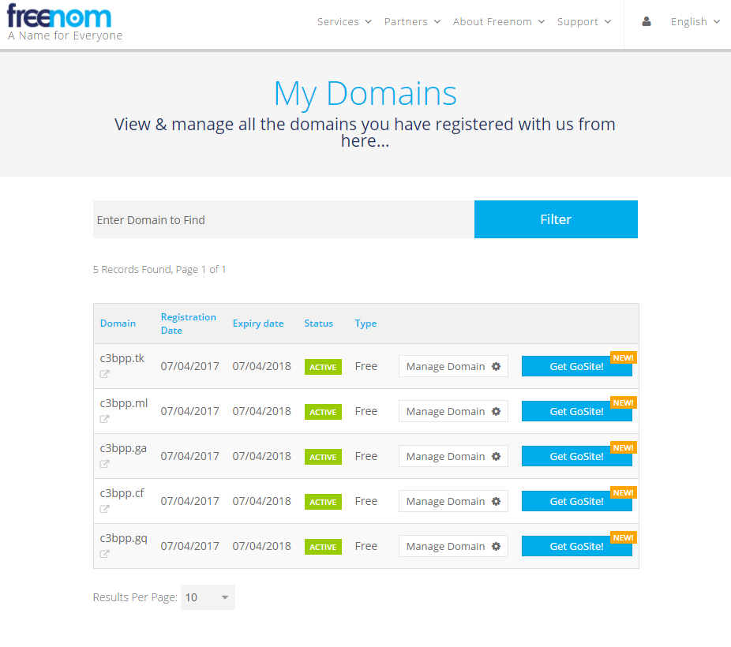
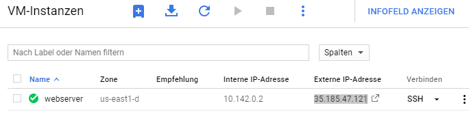
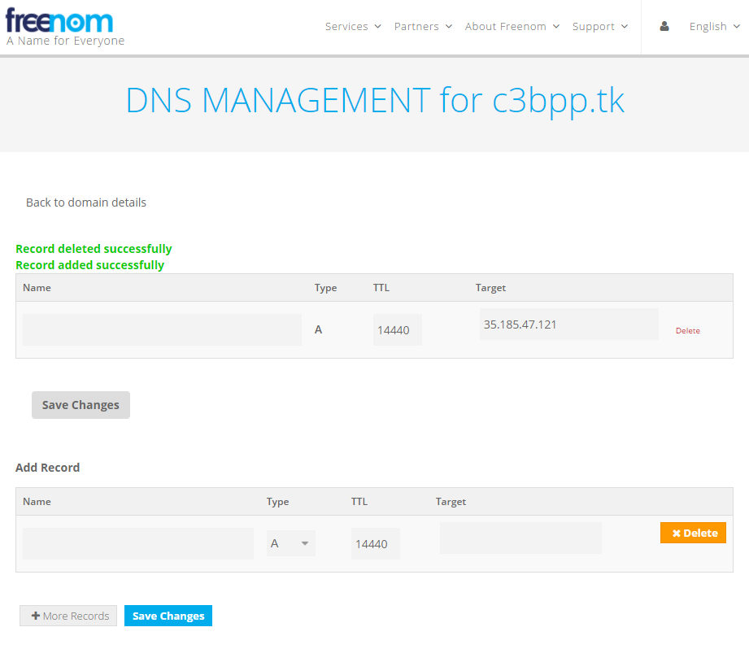

# DNS-Eintrag erstellen

Es würde natürlich reichen, einfach von extern über die IP-Adresse zuzugreifen, doch das ist echt nervig. Daher suchen wir uns einen netten und vor allem freien Namen aus für unseren Webserver und registrieren diesen bei einem DNS-Anbieter. Das kostet Geld. Wollen wir kein Geld ausgeben, müssen wir eine kostenlose Alternative dazu suchen.

Abgesehen davon ändert sich für unseren kostenlosen Server in der Google Cloud ständig die IP, sodass wir uns erst einmal einloggen und die richtige IP nachschauen müssen. Das macht auf Dauer auch keinen Spaß. Also müssen wir hier über Umwege zu einem festen Namen im Internet kommen. Natürlich können wir einen Dienst wie no-ip nehmen. In unserem Projekt wollen wir aber mal [freenom](http://www.freenom.com) benutzen, damit habe ich ganz gute Erfahrungen gemacht.

Dort hat man schnell eine Webadresse registriert und kommt kostenlos an die in unserem Projekt benutzte Domain "c3bpp.tk". Nebenbei hab ich auch alle anderen kostenlosen TLDs für mich registriert, wie man hier sehen kann:

Jetzt klicken wir auf "Manage Domain" und dann auf "Manage Freenom DNS" ganz rechts in der Zeile neben "Information". Dort klicken wir bei allen Einträgen, die dort schon vorgegeben sind ganz rechts auf "Delete" außer bei dem Eintrag, der ein leeres Feld unter der Kategorie "Name" hat. Jetzt müssen wir noch die aktuelle IP-Adresse des Servers in der Google Cloud kopieren (siehe graue Markierung).

Diese fügen wir dann unter "Target" ein und klicken auf "Save Changes". Unsere Eingaben werden dann in grüner Schrift bestätigt. Das sieht dann so aus:

Bis sich die IP des Servers bei Google ändert, haben wir nun einen gültigen DNS-Eintrag für unseren Server als "c3bpp.tk". Später kommen wir noch dazu, dass dieser Eintrag in regelmäßigen Abständen aktualisiert wird, damit der Server immer schön erreichbar bleibt.