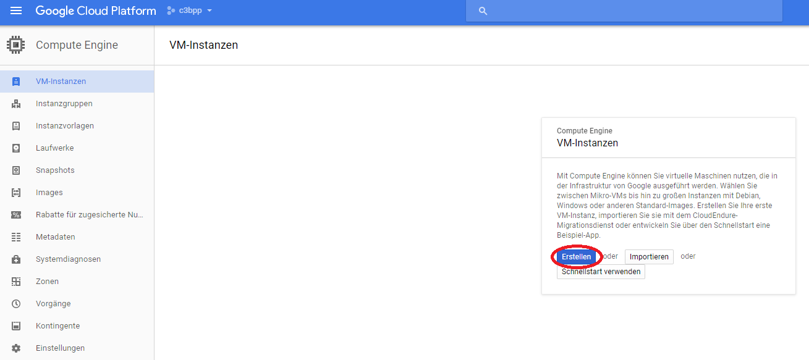
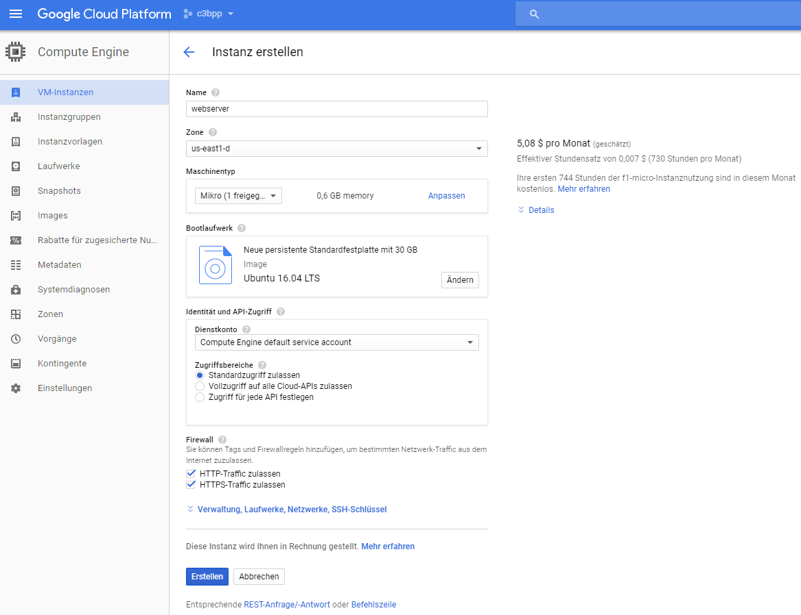
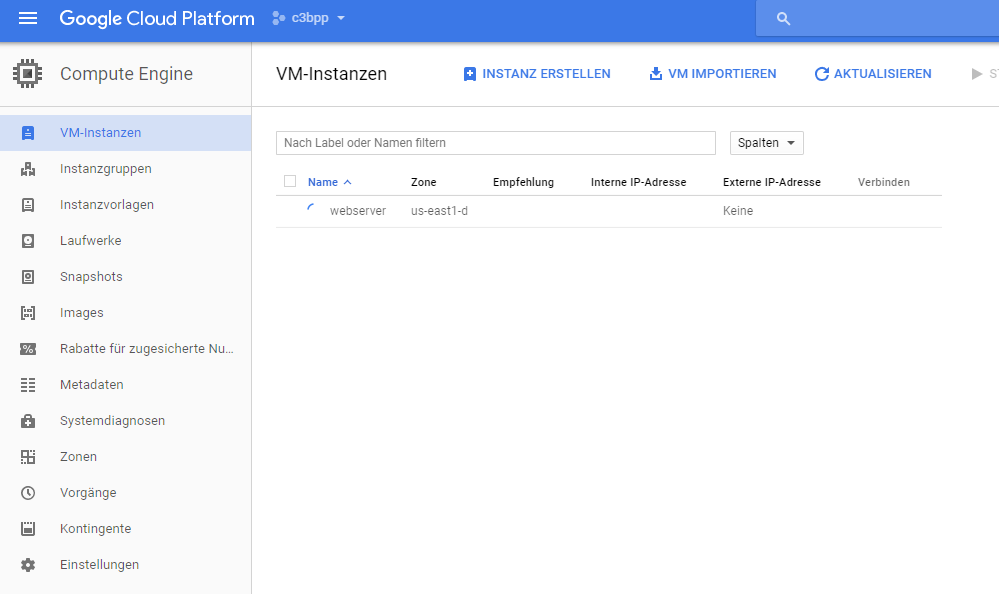
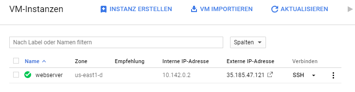

# Server erstellen

Die Google Cloud Platform bietet nach einem kostenlosen Testzeitraum, in dem ein virtuelles Guthaben verbraucht wird, einem Nutzer einen einzelnen kleinen Miniserver zum weiterhin kostenlosen Gebrauch. Hierdurch erhalten wir eine Platform, auf der wir unser Projekt umsetzen können.

Voraussetzung ist, dass ein Account bei [cloud.google.com](https://cloud.google.com) erstellt und ein Projekt erstellt wurde. Danach kommen wir schnell über den Link [console.cloud.google.com](htpps://console.cloud.google.com) zur grundlegenden Verwaltung des erstellten Servers. In diesem Beispiel heißt das Projekt "c3bpp". Hiernach erstellen wir uns einen Server über "Compute Engine" und "VM-Instanzen". Wir klicken dann auf "Erstellen". Das sieht so aus:

Wir klicken nun auf erstellen und sehen dann das folgende Bild, welches wir an unsere Bedürfnisse anpassen:

Wir wählen als Name für diesen Server einfach einmal "webserver" und als Zone, in der wir den Server erstellen eine Zone die mit "us-" beginnt. Bisher kann man nur in US-Zonen einen kostenlosen Server erstellen.

Als nächstes ist wichtig, dass wir als Maschinentyp "Mikro" auswählen. Dann sieht man auch auf der linken Seite den Hinweis, dass der Betrieb dieser Instanz kostenlos bleibt. Hierauf sollte man achten, es sei denn, Geld ist einem egal...

Für dieses Beispiel wählen wir als Bootlaufwerk die Linux-Distribution "Ubuntu 16.04 LTS" und stellen das Maximum einer kostenlosen Instanz an Speicherplatz ein: 30 GB. Weniger geht auch locker, aber warum nicht alles nehmen?

Bei Firewall können wir zunächst einmal anklicken, dass wir sowohl HTTP als auch HTTPS zulassen wollen. Danach klicken wir auf "Erstellen". Wir sollten jetzt das Folgende Bild sehen:

Sehen wir nun ein kleines grünes Häkchen vor unserem Servernamen, heißt das, dass unser Server bereit steht und wir weitermachen können.

