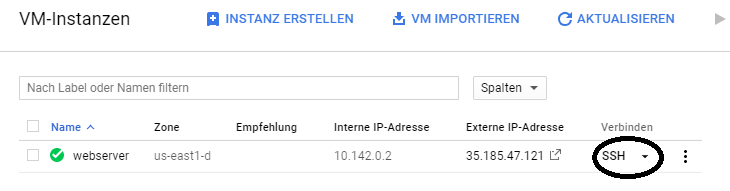
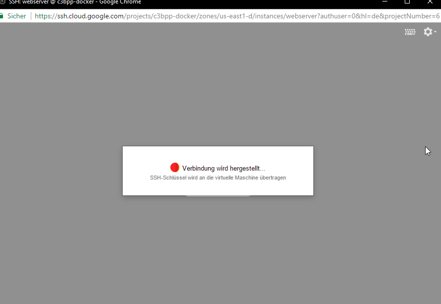
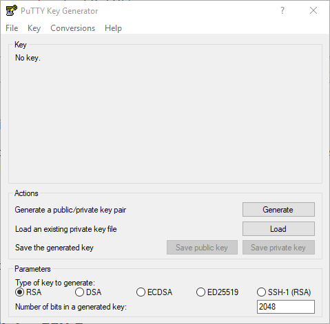
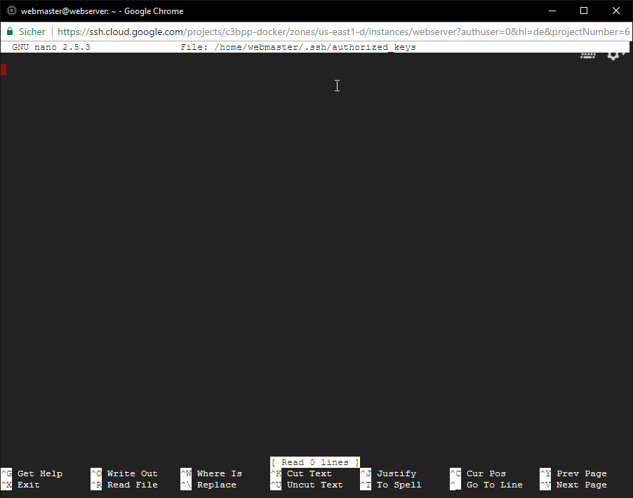
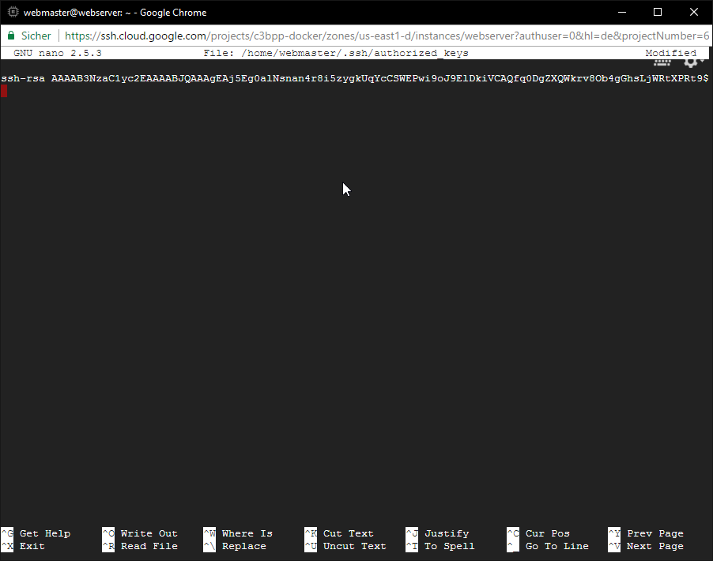
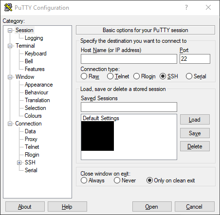
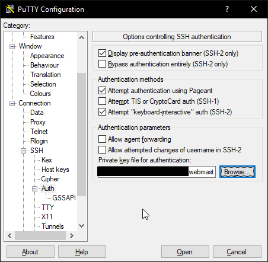
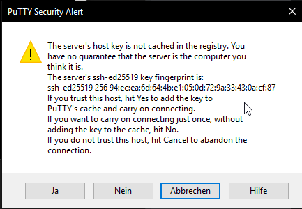
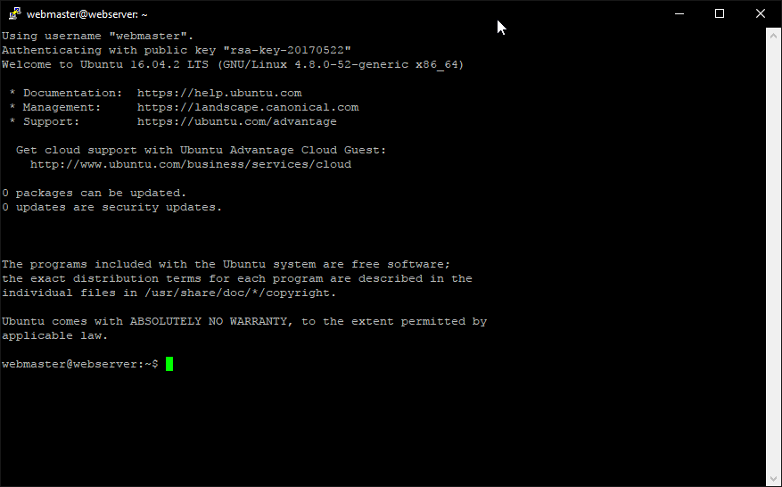

Title: SSH-Zugang einrichten
Date: 2017-05-27
Category: Tutorial

Wir sind nun in der Google Cloud Platform und schauen uns unter "Compute Engine" die "VM-Instanzen" an und klicken nun auf den Button "SSH".



Es öffnet sich nun ein neues Fenster, in dem ein SSH-Zugang für uns geöffnet wird. 



Damit haben wir dann Vollzugriff auf den Server. Da dieser Zugang aber kompromitiert werden könne (zum Beispiel, wenn jemand unser Google-Passwort in die Finger bekommt), erstellen wir nun einen eigenen Benutzer mit einem eigenen Passwort (keine Sorge, das werden wir später nicht mehr zum Einloggen nutzen, sondern nur für administrative Eingaben). Dafür geben wir folgenden Befehl ein:


```
sudo adduser webmaster
```

Wir werden auch nach einem neuen Passwort für diesen Benutzer gefragt. Und da wir möchten, dass dieser neue Benutzer auch Befehle ausführen kann, die administrative Rechte erfordern, fügen wir ihn zu der Benutzergruppe "sudo" hinzu.


```
sudo adduser webmaster sudo
```

Mit dem nun folgenden Befehl wechseln wir unsere Identität auf dem Server zu dem neuen Benutzer, den wir gerade erstellt haben. Wir werden nach dem Passwort, das wir eben gesetzt haben, gefragt.

```
su - webmaster
```

Nun sind wir auf dem neu erstellten Server mit einem neu erstellten Benutzer, mit dem wir hier weiterarbeiten wollen. Da es aber zu umständlich ist, sich immer über die Google Cloud Console hineinzuarbeiten, wollen wir uns auf unserem Computer einen eigenen SSH-Zugang einrichten. Wir benötigen hierfür einen SSH-Client. Gängig wäre da das Programm "PuTTY", dass wir uns auf [putty.org](http://www.putty.org/) kostenlos herunterladen können.

Nach der Installation finden wir mehrere nützliche Programme im Startmenü, eines davon brauchen wir jetzt: "PuTTYgen". Dieses öffnen wir uns nun.



Wem die Voreinstellungen reichen, kann jetzt auf "Generate" klicken, die Paranoiden unter uns können rechts unten gern eine höhere Bitzahl angeben (zum Beispiel "4096"). Dann sollte das generierte Schlüsselpaar mit jeweils einem Klick auf "Save public key" und "Save private key" gespeichert werden. Ich empfehle, den "private key" an einem sicheren Ort zu speichern. Zur Sicherheit kann man dem "private key" auch noch ein Passwort geben. Wenn man will.

Wir lassen dieses Fenster erst einmal offen, nachdem wir alles gespeichert haben und wenden uns wieder der Google Console zu. Dort geben wir die folgenden Befehle ein, um ein Verzeichnis zu erstellen, in dem der "public key", den wir eben generiert haben, gespeichert wird:

```
mkdir -p ~/.ssh
touch ~/.ssh/authorized_keys
```

Ubuntu bringt einen kleinen Texteditor auf Kommandozeilenebene mit, den wir nun nutzen, um die Datei ```authorized_keys``` zu bearbeiten.

```
nano ~/.ssh/authorized_keys
```

Das sollte so aussehen:



Jetzt rufen wir das Fenster von "PuTTYgen" wieder auf und kopieren den kompletten Text aus dem Feld "Public key for pasting into OpenSSH authorized_keys file:". Dann rufen wir das Konsolenfenser wieder auf und fügen den Text aus unserer Zwischenablage mit der Tastenkombination **"STRG + V"** dort ein. Das dürfte dann so ähnlich aussehen:



Mit der Tastenkombination **"STRG + X"** beenden wir die Bearbeitung und Bestätigen mit der Taste **"Y"**, dass wir die Datei so speichern wollen. Dann bestätigen wir noch mit **"ENTER"**, dass der Dateiname so bleiben soll.

Wenn wir sowohl den "private key" als auch den "public key" durch PuTTYgen wie eben beschrieben gespeichert haben, können wir dieses Programm jetzt schließen. Es folgen nun ein paar weitere Änderungen an der Konfiguration des Servers, die wir weiterhin in der Google Console durchführen.

Der Zugang zum Server von außen wird durch das Programm "OpenSSH" hergestellt, was im meistens in einem Ubuntu Server von vornherein installiert ist. Diesen SSH-Server müssen wir nun mitteilen, dass er bei einem Login nach einem Schlüssel verlangt und den Zugang möglichst gut absichert. Deswegen müssen wir die Konfigurationsdatei des SSH-Servers bearbeiten, was wir mit dem folgenden Befehl tun:

```
sudo nano /etc/ssh/sshd_config
```

Nachdem wir nach unserem Passwort gefragt wurden, öffnet sich der Texteditor und zeigt uns die Einstellungsdatei, die wir nun abändern wollen. Dort gibt es einen Abschnitt, der so aussieht:

```
...
HostKey /etc/ssh/ssh_host_rsa_key
HostKey /etc/ssh/ssh_host_dsa_key
HostKey /etc/ssh/ssh_host_ecdsa_key
HostKey /etc/ssh/ssh_host_ed25519_key
...
```

Daraus machen wir:

```
...
HostKey /etc/ssh/ssh_host_rsa_key
#HostKey /etc/ssh/ssh_host_dsa_key
#HostKey /etc/ssh/ssh_host_ecdsa_key
HostKey /etc/ssh/ssh_host_ed25519_key
...
```

Mit dieser Raute deaktivieren wir die betreffenden Zeilen, der Server wird sie als Kommentar ignorieren.

Als nächstes fügen wir (von mir aus direkt unter den eben bearbeiteten Zeilen) die folgenden Zeilen ein:

```
KexAlgorithms curve25519-sha256@libssh.org,diffie-hellman-group-exchange-sha256
Ciphers chacha20-poly1305@openssh.com,aes256-gcm@openssh.com,aes128-gcm@openssh.com,aes256-ctr,aes192-ctr,aes128-ctr
MACs hmac-sha2-512-etm@openssh.com,hmac-sha2-256-etm@openssh.com,hmac-ripemd160-etm@openssh.com,umac-128-etm@openssh.com,hmac-sha2-512,hmac-sha2-256,hmac-ripemd160,umac-128@openssh.com
```

Hierdurch sorgen wir für möglichst zuverlässige Verschlüsselung zwischen dem Server und unserem Client, mit dem wir uns dann später zum Server verbinden werden (siehe hierzu auch [cipherli.st](https://cipherli.st/) und [stribika.github.io](https://stribika.github.io/2015/01/04/secure-secure-shell.html)). Dann haben wir noch weitere Änderungen vor uns. Wir suchen die Zeile

```
PermitRootLogin prohibit-password
```

Und ändern diese auf

```
PermitRootLogin no
```

Dann entfernen wir das "#" aus der Zeile

```
#AuthorizedKeysFile     %h/.ssh/authorized_keys
```

sodass sie dann so aussieht:

```
AuthorizedKeysFile     %h/.ssh/authorized_keys
```

Sicherheitshalber suchen wir noch die Zeile

```
PasswordAuthentication no
```

Und stellen sicher, dass da auch wirklich ```no``` steht.

Jetzt beenden wir die Bearbeitung dieser Datei wie gehabt mit der Tastenkombination **"STRG + X"**, bestätigen mit der Taste **"Y"**, dass wir alles so speichern wollen und bestätigen mit **"ENTER"**, dass der Dateiname so bleiben soll.

Der SSH-Server muss nun neu gestartet werden, damit die Änderungen auch wirken. Dies bewerkstelligen wir mit dem folgenden Befehl:

```
sudo service ssh restart
```

Nur für den Fall, dass wir irgend einen Fehler gemacht haben, lassen wir die Google Console noch offen. Wir müssen nun testen, ob wir mit PuTTY auf den Server kommen. Dazu öffnen wir das Programm PuTTY, was so aussieht:



Unter "Host Name (or IP adress)" tragen wir dann den vergebenen Benutzernamen gefolgt von einem @ und unserer Domain ein. In unserem Beispiel ist es

```
webmaster@c3bpp.tk
```

Auf der rechten Seite des Fensters finden wir einen kleinen Kategorienbaum, dort öffenen wir "SSH" und klicken auf "Auth". Dort finden wir ein Feld "Private key file for authentication". Dort stellen wir ein, wo PuTTY unseren "private key" finden kann. Das sieht dann so aus:



Im Kategoriebaum klicken wir ganz oben wieder auf Session und tragen unter "Saved Sessions" den Namen unserer Session ein. Ich schlage hier einfach einmal "webmaster" vor. Kann aber frei gewählt werden. Wenn alles richtig gemacht wurde, wird sich nach einem Klick auf "Open" ein neues Konsolenfenster öffnen, in dem wir direkt dann als Benutzer "webmaster" auf unserem Server eingeloggt werden. Es sollte noch eine Warnung kommen wie diese hier:



Das können wir mit "Ja" bestätigen, da wir gerade erst den Server aufgesetzt haben. Wenn diese Warnung kommt, wenn wir schon länger diesen Server eingerichtet hatte, sollten wir uns Gedanken machen, wer denn auf dem Server Änderungen an der Verschlüsselung gemacht hat...

Nachdem die Warnung von uns bestätigt wurde, sollten wir nun ein solches Fenster sehen:



Damit haben wir einen aktuell sicheren Zugang per SSH zu unserem Server und können nun weitermachen mit unserem Projekt. Die Google Console können wir nun schließen, denn wir werden nun nur noch mit PuTTY auf unseren Server zugreifen, indem wir die gespeicherte Session mit einem Klick auf "Load" aufrufen und mit einem Klick auf "Open" die Verbindung zum Server herstellen.